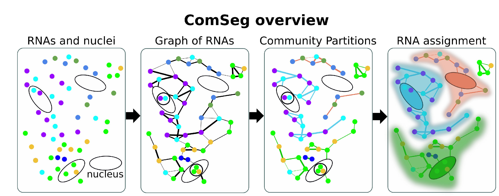

# News
- Update with comseg 0.0.8. Compatibility with SOPA : https://gustaveroussy.github.io/sopa/

- Update with comseg 0.0.7. Computation of the co-expression matrix is now faster.

# Support

If you have any questions relative to the package or bug, please open an issue in this repository.

# ComSeg framework

A detail documentation is available at https://comseg.readthedocs.io/

# Single cell spatial RNA profiling 

ComSeg is an algorithm for single cell spatial RNA profiling in image-based transcriptomic data.

It takes as input a csv with the spot coordinates and output an anndata 
object with the  genes expression and coordinates of each cell.

### Citation 

A point cloud segmentation framework for image-based spatial transcriptomic, Defard et al bioRxiv 2023.12.01.569528; doi: https://doi.org/10.1101/2023.12.01.569528

